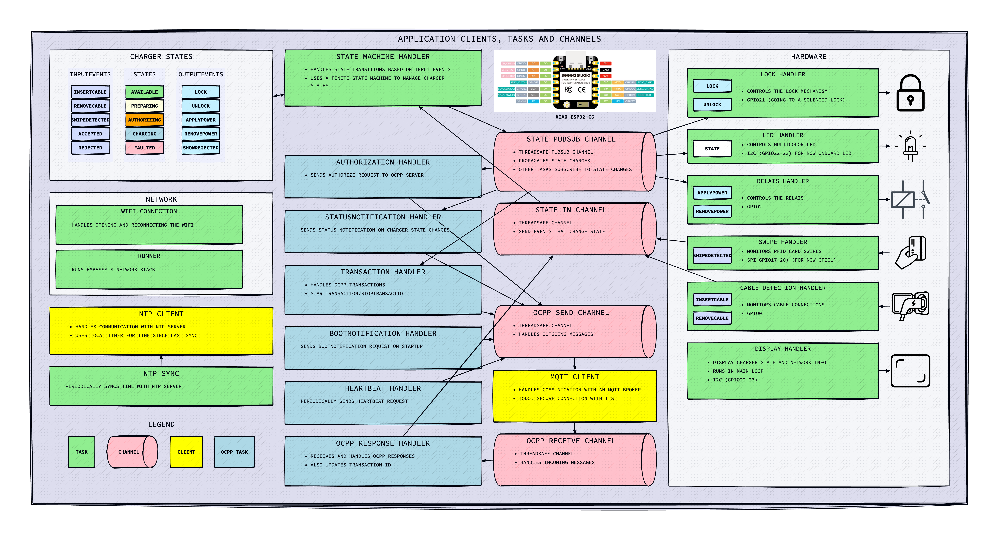
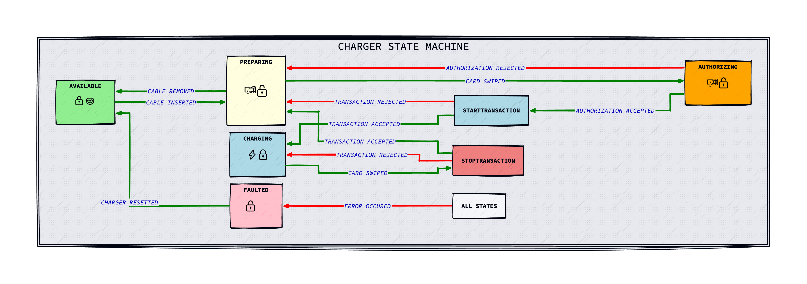

# ESP32-C6 Embassy Charged

An ESP32-C6 based electric vehicle charging station built with Embassy async runtime and OCPP 1.6 support.

## Quick Start

### 1. Configuration Setup

Copy the example configuration file and update it with your settings:

```bash
cp app_config.toml.example app_config.toml
```

Edit `app_config.toml` with your actual values:

```toml
[wifi]
ssid = "YOUR_WIFI_NETWORK"
password = "YOUR_WIFI_PASSWORD"

[charger]
name = "esp32c6 charger 001"
model = "ESP32-C6"
vendor = "GA Make"
serial = "esp32c6-charger-001"

[mqtt]
broker = "broker.hivemq.com"
port = 1883
client_id = "esp32c6-charger-001"
```

### 2. Environment Variable Overrides (Optional)

You can override any configuration value using environment variables, the naming i:

```
CHARGER_<section>_key>
for instance CHARGER_WIFI_ID
```

### 3. Build and Flash

```bash
cargo build
cargo run
```

## OCPP Protocol Support

The charger implements OCPP 1.6 protocol:

### Outgoing Messages (Published to `/charger/{serial}`)
- **Authorize**: Sent when a user swipes their card for authorization
- **BootNotification**: Sent once at startup with charger model, vendor and serial details
- **Heartbeat**: Periodic status updates with configurable interval
- **StartTransaction**: Charging session initiation with ID tag and timestamp
- **StopTransaction**: Charging session completion with transaction ID and timestamp

### Responses and incoming Messages (Subscribed to `/system/{serial}`)

## Development

This project uses:
- **Embassy**: Async runtime for embedded Rust with concurrent task management
- **ESP-HAL**: Hardware abstraction for ESP32-C6
- **OCPP-RS**: Open Charge Point Protocol implementation
- **Embassy-Net**: Networking stack with WiFi and MQTT support
- **Rust-MQTT**: Lightweight MQTT client for embedded systems

### Architecture
The system is built around Embassy async tasks:
- **Network Stack**: WiFi connection management and IP configuration
- **MQTT Client**: Bidirectional message of OCPP Messages
- **NTP Client**: Queries NTP Server every 4 hours and syncing with local timer in the ESP32-C6
- **OCPP 1.6**: minimum support for OCPP 1.6 to support basic Charging behaviour
- **Hardware Tasks**: GPIO monitoring for cable detection, card swipes. Led and Relay control and update a small display
- **Periodic Tasks**: for instance Heartbeat transmission and boot notifications (once)

#### Application Diagram



#### State Diagram



### Memory Management
- **Heap Size**: 64KB allocated for dynamic memory
- **Message Buffers**: 2048-byte capacity for larger OCPP messages
- **Channel Queues**: 5-message capacity for MQTT send/receive operations
- **Static Allocation**: Embassy static cells for zero-allocation async runtime

## Security Note

The `app_config.toml` file contains sensitive information (WiFi passwords, etc.) and is excluded from version control. Always use the `.example` file as a template for new deployments.
